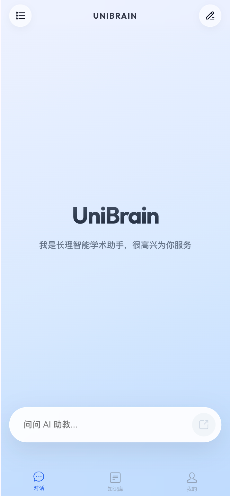
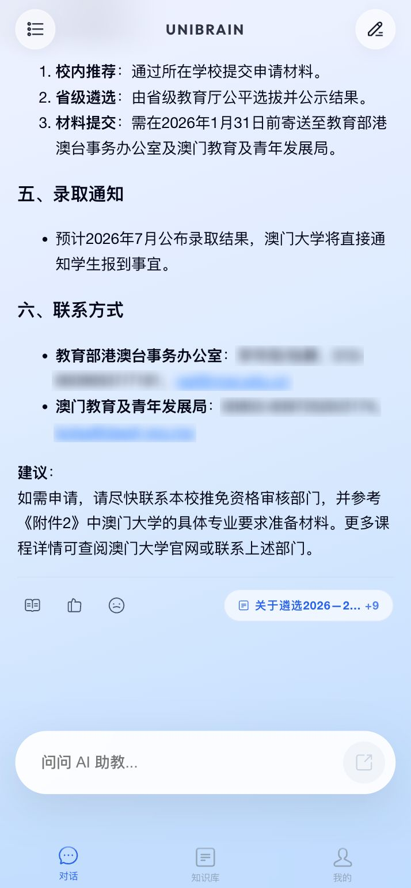
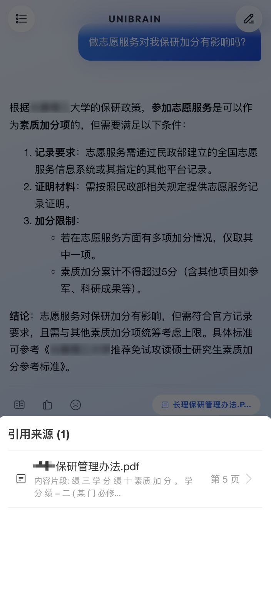
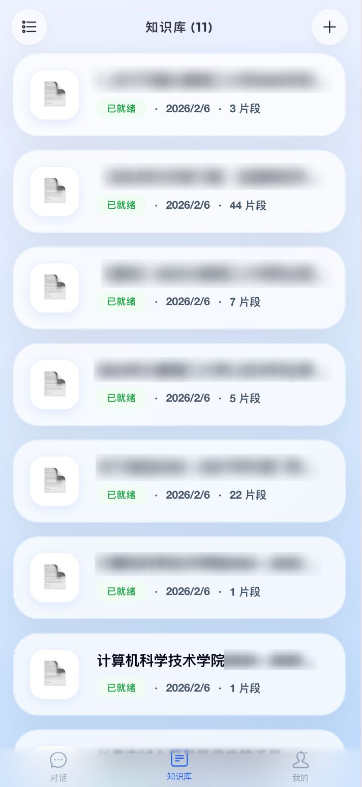
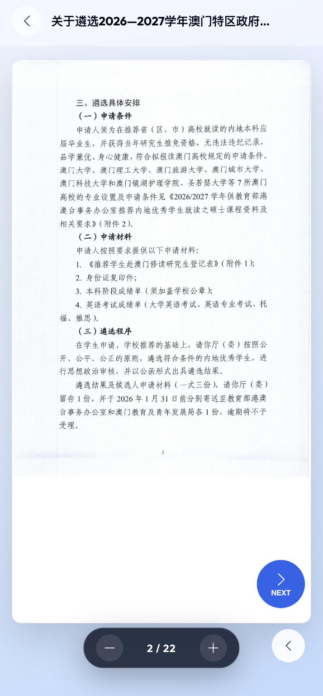
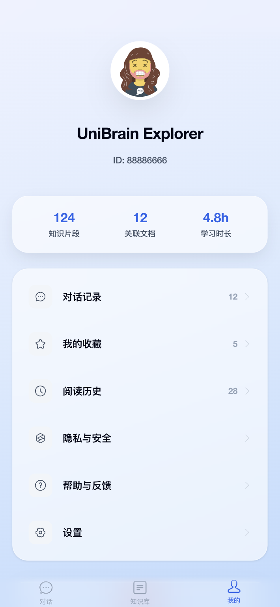

# UniBrain

[](https://github.com/Marshmallowc/UniBrain/stargazers)
[](https://github.com/Marshmallowc/UniBrain/network/members)
[](https://github.com/Marshmallowc/UniBrain/blob/master/LICENSE)

UniBrain 是一款专为学术环境设计的智能化知识库系统。基于 RAG (Retrieval-Augmented Generation) 技术架构，系统能够深度解析上传的 PDF 文档，通过向量语义检索为用户提供具备事实依据的 AI 辅助决策与知识检索服务。

> **项目状态**：本项目目前处于 **Alpha (Preview)** 阶段。核心功能已实现，但仍处于活跃迭代中，部分工程化细节与多用户鉴权模块尚在开发。欢迎提交 Issue 或 Pull Request 参与共建。

---

## 界面预览

| 智能对话 (初始) | 智能对话 (结果) | 引用来源溯源 |
| :---: | :---: | :---: |
|  |  |  |

| 学术文库 | PDF 阅读器 | 个人中心 |
| :---: | :---: | :---: |
|  |  |  |

---

## 核心特性

- **基于 RAG 的精准问答**：集成高性能向量数据库，通过语义关联减少模型幻觉，确保回答内容具备文档支撑。
- **SSE 流式交互响应**：采用 Server-Sent Events 技术实现打字机式实时输出，优化大规模文本生成的交互体验。
- **深度 PDF 解析与 OCR**：整合 Poppler 与 Tesseract.js 引擎，支持对文本型及扫描型 PDF 的深度扫描与结构化提取。
- **引用溯源系统**：系统自动标注知识来源，支持从对话内容直接定位至 PDF 源文件的具体页码。
- **全栈容器化部署**：提供完整的 Docker 容器化配置，支持 MySQL、ChromaDB 及应用服务的快速环境编排。
- **移动端适配与优化**：采用现代 UI 设计规范，深度适配移动端交互操作逻辑。

---

## 功能模块

- **智能对话中心 (Chat)**：支持上下文关联的连续对话，提供基于私有知识库的流式问答建议。
- **学术文库管理 (Library)**：提供文档的上传、状态解析监控、多维检索及物理同步删除等管理功能。
- **交互式 PDF 阅读器 (Reader)**：内置 PDF 渲染引擎，支持与对话系统联动实现精准的知识点定位阅读。
- **个人管理系统 (Me)**：用户配置管理、学习足迹追踪及个性化偏好设置。

---

## 技术架构

### 前端开发栈
- **核心框架**: React 18 / TypeScript / Vite
- **UI 组件**: Ant Design Mobile 5.x
- **状态管理**: Zustand
- **文档渲染**: React-PDF / React-Markdown

### 后端服务栈
- **框架**: NestJS (Node.js)
- **数据库**: MySQL 8.0 (元数据存储) / ChromaDB (向量存储)
- **数据访问**: Prisma ORM
- **AI 引擎**: OpenAI SDK (支持 DeepSeek / SiliconFlow 兼容网关)
- **处理引擎**: Poppler-utils / Tesseract.js OCR

---

## 快速开始

### 1. 基础环境准备
确保本地已安装 `git`, `Docker` 及 `Node.js` 环境。

### 2. 获取代码与配置
```bash
git clone https://github.com/Marshmallowc/UniBrain.git
cd UniBrain
```

1. 参考根目录及 `server` 目录下的 `.env.example` 文件。
2. 创建对应的 `.env` 文件并填入你的 API 密钥及数据库连接字符串。
3. **注意**：切勿将包含真实 Key 的 `.env` 文件上传至任何公共仓库。

### 3. 一键部署
```bash
docker-compose up -d
```
启动后可通过以下地址访问：
- 前端服务: `http://localhost:5173`
- 后端 API: `http://localhost:3000`

---

## 项目路线图

- [ ] 优化 UI 动效细节与多级主题支持。
- [ ] 增加多文档协同检索与批量管理功能。
- [ ] 引入知识图谱可视化，展示文档关联逻辑。
- [ ] 优化复杂数学公式及图表的识别渲染能力。

---

## 开源协议

本项目遵循 [MIT License](LICENSE) 协议发布。
